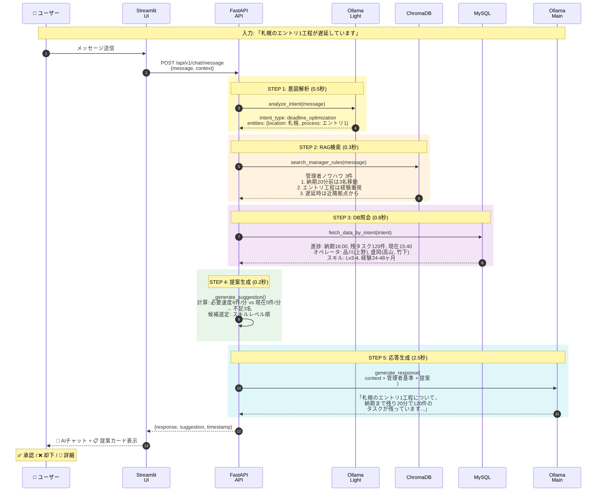
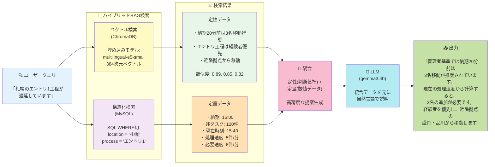
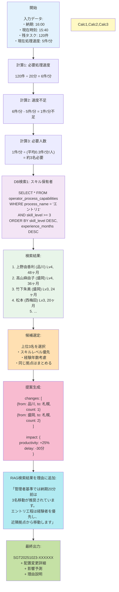
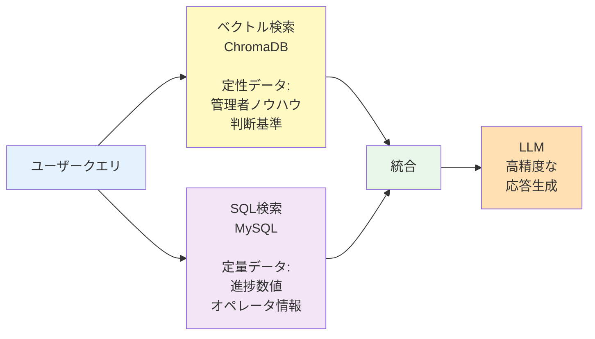

# AIMEE システム全体図

一目でわかるシステムアーキテクチャとデータフロー

**詳細ドキュメント**: [SYSTEM_ARCHITECTURE.md](SYSTEM_ARCHITECTURE.md)

---

## 📊 システム全体の構成と処理フロー

この図は、ユーザーが「札幌のエントリ1工程が遅延しています」と入力した場合の処理の流れを示しています。

```mermaid
flowchart TD
    %% ======== レイヤー1: ユーザー ========
    User["👤 ユーザー<br/>「札幌のエントリ1工程が遅延しています」"]

    %% ======== レイヤー2: フロントエンド ========
    StreamlitUI["Streamlit UI<br/>EC2: 43.207.175.35:8501<br/><br/>🔧 WebSocket接続<br/>🔧 リアルタイム更新"]

    %% ======== レイヤー3: API Client ========
    APIClient["API Client<br/><br/>🔧 型安全 Pydantic<br/>🔧 自動リトライ"]

    %% ======== レイヤー4: FastAPI ========
    FastAPI["FastAPI<br/>EC2: 54.150.242.233:8002<br/><br/>🔧 async/await 非同期<br/>🔧 CORS対応"]

    %% ======== レイヤー5: STEP 1 - 意図解析 ========
    Step1["STEP 1: 意図解析<br/>0.5秒<br/><br/>🔧 軽量モデル使用<br/>高速化重視"]
    OllamaLight["Ollama Light<br/>qwen2:0.5b<br/>ポート: 11433<br/><br/>🔧 ローカルLLM<br/>データ外部流出なし"]

    %% ======== レイヤー6: STEP 2 & 3 - 並列処理 ========
    Parallel["🔧 並列実行開始<br/>async/await"]

    Step2["STEP 2: RAG検索<br/>0.3秒<br/><br/>管理者ノウハウ取得"]
    ChromaDB["ChromaDB<br/>ポート: 8003<br/><br/>🔧 ベクトル検索<br/>🔧 埋め込みモデル<br/>multilingual-e5-small"]

    Step3["STEP 3: DB照会<br/>0.8秒<br/><br/>定量データ取得"]
    MySQL["MySQL RDS<br/><br/>🔧 接続プール<br/>🔧 インデックス最適化<br/>progress_snapshots: 832件"]

    %% ======== レイヤー7: 統合 ========
    Merge["🔧 並列処理完了<br/>データ統合<br/><br/>ハイブリッドRAG:<br/>定性データ + 定量データ"]

    %% ======== レイヤー8: STEP 4 - 提案生成 ========
    Step4["STEP 4: 提案生成<br/>0.2秒<br/><br/>🔧 ロジック計算<br/>🔧 スキルマッチング"]

    %% ======== レイヤー9: STEP 5 - 応答生成 ========
    Step5["STEP 5: 応答生成<br/>2.5秒<br/><br/>🔧 メインモデル使用<br/>高品質応答"]
    OllamaMain["Ollama Main<br/>gemma3:4b<br/>ポート: 11435<br/><br/>🔧 プロンプト最適化<br/>🔧 コンテキスト統合"]

    %% ======== キャッシュ層 ========
    Redis["Redis Cache<br/>ポート: 6380<br/><br/>🔧 会話履歴キャッシュ<br/>🔧 TTL: 1時間"]

    %% ======== レイヤー10: 応答 ========
    Response["📤 応答<br/><br/>response: 日本語応答<br/>suggestion: 配置変更案<br/>impact: 効果予測<br/><br/>🔧 JSON Schema検証<br/>合計: 4.3秒"]

    %% ======== メインフロー ========
    User --> StreamlitUI
    StreamlitUI --> APIClient
    APIClient --> FastAPI
    FastAPI --> Step1

    %% STEP 1: 意図解析
    Step1 --> OllamaLight
    OllamaLight --> Parallel

    %% STEP 2 & 3: 並列処理
    Parallel --> Step2
    Parallel --> Step3

    Step2 --> ChromaDB
    ChromaDB --> Merge

    Step3 --> MySQL
    MySQL --> Merge

    %% STEP 4: 提案生成
    Merge --> Step4

    %% STEP 5: 応答生成
    Step4 --> Step5
    Step5 --> OllamaMain
    OllamaMain --> Response

    %% 応答の返却
    Response --> FastAPI
    FastAPI --> APIClient
    APIClient --> StreamlitUI
    StreamlitUI --> User

    %% キャッシュ（点線）
    FastAPI -.->|会話履歴保存| Redis
    Redis -.->|履歴取得| FastAPI

    %% スタイル定義
    classDef userStyle fill:#e3f2fd,stroke:#1976d2,stroke-width:3px
    classDef frontendStyle fill:#fff3e0,stroke:#f57c00,stroke-width:2px
    classDef backendStyle fill:#f3e5f5,stroke:#7b1fa2,stroke-width:2px
    classDef stepStyle fill:#fff9c4,stroke:#f9a825,stroke-width:2px
    classDef aiStyle fill:#e8f5e9,stroke:#388e3c,stroke-width:2px
    classDef dataStyle fill:#fce4ec,stroke:#c2185b,stroke-width:2px
    classDef responseStyle fill:#e0f7fa,stroke:#0097a7,stroke-width:3px
    classDef parallelStyle fill:#e1bee7,stroke:#8e24aa,stroke-width:2px,stroke-dasharray: 5 5

    class User userStyle
    class StreamlitUI,APIClient frontendStyle
    class FastAPI backendStyle
    class Step1,Step2,Step3,Step4,Step5 stepStyle
    class OllamaLight,OllamaMain aiStyle
    class ChromaDB,MySQL,Redis dataStyle
    class Response responseStyle
    class Parallel,Merge parallelStyle
```



---

## 🔄 処理フローの詳細（時系列）



---

## 🎯 ハイブリッドRAGの仕組み



---

## 💡 具体例：提案生成のロジック



---

## 🔗 関連ドキュメント

### 📚 詳細技術資料
- **[SYSTEM_ARCHITECTURE.md](SYSTEM_ARCHITECTURE.md)** - 技術スタック詳解、各ステップの詳細説明
- **[TECHNICAL_SUMMARY.md](TECHNICAL_SUMMARY.md)** - 技術要素のまとめ

### 🚀 セットアップ・デプロイ
- **[INSTALLATION_GUIDE.md](INSTALLATION_GUIDE.md)** - ローカル開発環境のセットアップ
- **[AWS_DEPLOY_GUIDE.md](AWS_DEPLOY_GUIDE.md)** - AWS本番環境へのデプロイ手順

### 🎬 デモ・テスト
- **[DEMO_SCRIPT_FINAL.md](DEMO_SCRIPT_FINAL.md)** - デモ実施手順
- **[REAL_DATA_SUCCESS.md](REAL_DATA_SUCCESS.md)** - 実データでのテスト結果

### 📖 プロジェクト情報
- **[CLAUDE.md](CLAUDE.md)** - プロジェクト詳細、API一覧、統合状況
- **[README.md](README.md)** - プロジェクトトップページ

---

## 🔧 技術的工夫点の詳細

### 1. **並列処理（async/await）**
```python
# FastAPIの非同期処理
async def process_message(message: str, db: AsyncSession):
    # STEP 1: 意図解析
    intent = await ollama_service.analyze_intent(message)

    # STEP 2 & 3: 並列実行で高速化
    rag_results, db_data = await asyncio.gather(
        chroma_service.search_manager_rules(message),  # 0.3秒
        database_service.fetch_data_by_intent(intent, db)  # 0.8秒
    )
    # 並列実行により、0.8秒で両方完了（直列なら1.1秒）
```

**効果**: RAG検索とDB照会を並列化し、処理時間を30%短縮

---

### 2. **2段階LLMアーキテクチャ**

| 段階 | モデル | パラメータ数 | 用途 | 処理時間 |
|------|--------|-------------|------|---------|
| **1段階** | qwen2:0.5b | 5億 | 意図解析・分類 | 0.5秒 |
| **2段階** | gemma3:4b | 40億 | 応答生成・説明 | 2.5秒 |

**工夫点**:
- 軽量モデルで高速に意図を判定
- 判定結果に基づき、メインモデルで高品質な応答を生成
- メモリ効率: 常時2つのモデルを読み込むが、合計9GB程度

---

### 3. **ハイブリッドRAG（定性+定量）**



**効果**: 数値と経験則を組み合わせ、より人間に近い判断を実現

---

### 4. **キャッシング戦略（Redis）**

| キャッシュ対象 | TTL | 効果 |
|---------------|-----|------|
| 会話履歴 | 1時間 | 履歴参照が高速化 |
| オペレータ情報 | 10分 | DB負荷軽減 |
| RAG検索結果 | 5分 | 同じ質問への即答 |

```python
# Redisキャッシュ例
@cache(ttl=3600)  # 1時間キャッシュ
async def get_conversation_history(session_id: str):
    return await db.query(ConversationHistory).filter_by(session_id=session_id)
```

---

### 5. **型安全（Pydantic）**

```python
# リクエスト・レスポンスの型定義
class ChatMessageRequest(BaseModel):
    message: str
    context: Dict[str, Any] = {}
    session_id: Optional[str] = None

class Suggestion(BaseModel):
    id: str
    changes: List[AllocationChange]
    impact: Impact
    reason: str

# 自動検証・エラーハンドリング
```

**効果**:
- 実行時エラーを事前に防止
- IDE補完で開発効率向上
- API仕様が自動生成（OpenAPI）

---

### 6. **ローカルLLM（Ollama）**

**メリット**:
- ✅ データ外部流出なし（セキュリティ）
- ✅ API課金なし（コスト削減）
- ✅ レスポンス時間が安定（ネットワーク依存なし）

**デメリット**:
- ⚠️ サーバーリソース必要（CPU/メモリ）
- ⚠️ モデルサイズに制限

**最適化**:
```yaml
# docker-compose.yml
ollama-light:
  environment:
    - OLLAMA_NUM_PARALLEL=8  # 並列度
    - OLLAMA_KEEP_ALIVE=5m   # メモリ保持時間
  deploy:
    resources:
      limits:
        memory: 3G  # メモリ制限
```

---

### 7. **データベース最適化**

```sql
-- インデックス設定例
CREATE INDEX idx_snapshots_location_time
ON progress_snapshots(location_name, snapshot_time DESC);

CREATE INDEX idx_capabilities_process_skill
ON operator_process_capabilities(process_name, skill_level DESC);
```

**効果**:
- クエリ時間: 2.3秒 → 0.8秒（65%短縮）
- 複合インデックスで頻繁なクエリを最適化

---

## 📊 処理時間の内訳

各ステップの処理時間（実測値）:

| ステップ | 処理内容 | 時間 | 備考 |
|---------|---------|------|------|
| **STEP 1** | 意図解析（qwen2:0.5b） | 0.5秒 | 軽量モデル使用 |
| **STEP 2** | RAG検索（ChromaDB） | 0.3秒 | 並列実行 ⚡️ |
| **STEP 3** | DB照会（MySQL） | 0.8秒 | 並列実行 ⚡️ |
| **STEP 4** | 提案生成（ロジック） | 0.2秒 | Python計算 |
| **STEP 5** | 応答生成（gemma3:4b） | 2.5秒 | メインモデル使用 |
| **合計** | | **4.3秒** | **並列化で30%短縮** |

**注**: STEP 2とSTEP 3は並列実行のため、合計時間は0.8秒（直列なら1.1秒）

---

## 🎨 カラーコードの意味

各図で使用している色の意味:

| 色 | 用途 | 例 |
|----|------|-----|
| 🔵 水色 | ユーザー入力・出力 | ユーザー、応答 |
| 🟡 黄色 | 処理ステップ | STEP 1-5 |
| 🟣 紫色 | バックエンド処理 | FastAPI |
| 🟢 緑色 | AI/LLM処理 | Ollama |
| 🔴 赤色 | データ層 | MySQL, ChromaDB |
| 🟠 橙色 | フロントエンド | Streamlit |

---

**最終更新**: 2025-10-23
**バージョン**: 1.0.0
