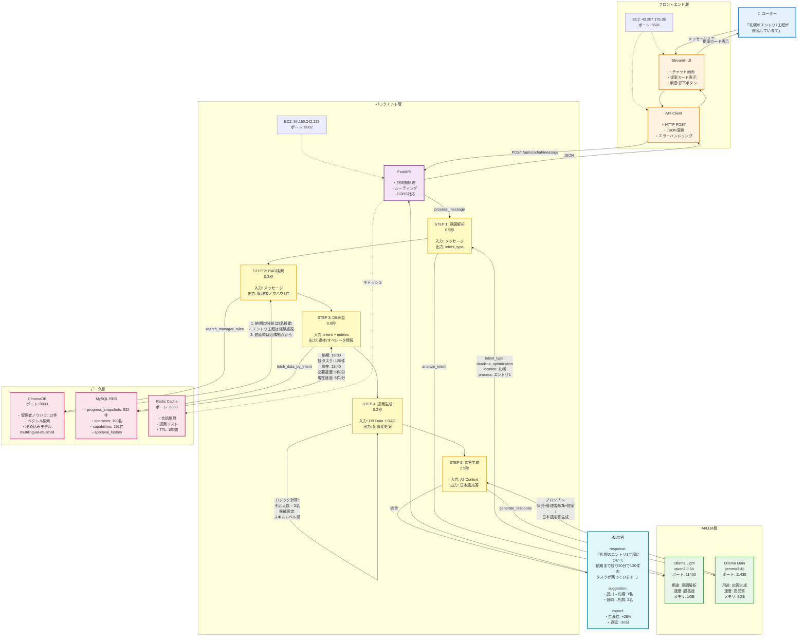

# AIMEE システム全体図

一目でわかるシステムアーキテクチャとデータフロー

**詳細ドキュメント**: [SYSTEM_ARCHITECTURE.md](SYSTEM_ARCHITECTURE.md)

---

## 📊 システム全体の構成と処理フロー

この図は、ユーザーが「札幌のエントリ1工程が遅延しています」と入力した場合の処理の流れを示しています。

---

## 🔄 処理フローの詳細（時系列）

---

## 🎯 ハイブリッドRAGの仕組み

---

## 💡 具体例：提案生成のロジック

---

## 🔗 関連ドキュメント

### 📚 詳細技術資料
- **[SYSTEM_ARCHITECTURE.md](SYSTEM_ARCHITECTURE.md)** - 技術スタック詳解、各ステップの詳細説明
- **[TECHNICAL_SUMMARY.md](TECHNICAL_SUMMARY.md)** - 技術要素のまとめ

### 🚀 セットアップ・デプロイ
- **[INSTALLATION_GUIDE.md](INSTALLATION_GUIDE.md)** - ローカル開発環境のセットアップ
- **[AWS_DEPLOY_GUIDE.md](AWS_DEPLOY_GUIDE.md)** - AWS本番環境へのデプロイ手順

### 🎬 デモ・テスト
- **[DEMO_SCRIPT_FINAL.md](DEMO_SCRIPT_FINAL.md)** - デモ実施手順
- **[REAL_DATA_SUCCESS.md](REAL_DATA_SUCCESS.md)** - 実データでのテスト結果

### 📖 プロジェクト情報
- **[CLAUDE.md](CLAUDE.md)** - プロジェクト詳細、API一覧、統合状況
- **[README.md](README.md)** - プロジェクトトップページ

---

## 📊 処理時間の内訳

各ステップの処理時間（実測値）:

| ステップ | 処理内容 | 時間 |
|---------|---------|------|
| **STEP 1** | 意図解析（qwen2:0.5b） | 0.5秒 |
| **STEP 2** | RAG検索（ChromaDB） | 0.3秒 |
| **STEP 3** | DB照会（MySQL） | 0.8秒 |
| **STEP 4** | 提案生成（ロジック） | 0.2秒 |
| **STEP 5** | 応答生成（gemma3:4b） | 2.5秒 |
| **合計** | | **4.3秒** |

---

## 🎨 カラーコードの意味

各図で使用している色の意味:

| 色 | 用途 | 例 |
|----|------|-----|
| 🔵 水色 | ユーザー入力・出力 | ユーザー、応答 |
| 🟡 黄色 | 処理ステップ | STEP 1-5 |
| 🟣 紫色 | バックエンド処理 | FastAPI |
| 🟢 緑色 | AI/LLM処理 | Ollama |
| 🔴 赤色 | データ層 | MySQL, ChromaDB |
| 🟠 橙色 | フロントエンド | Streamlit |

---

**最終更新**: 2025-10-23
**バージョン**: 1.0.0
