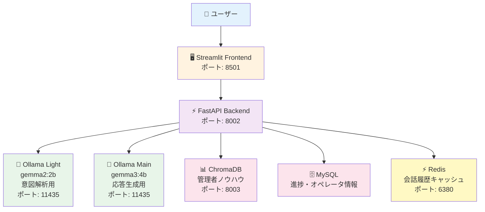
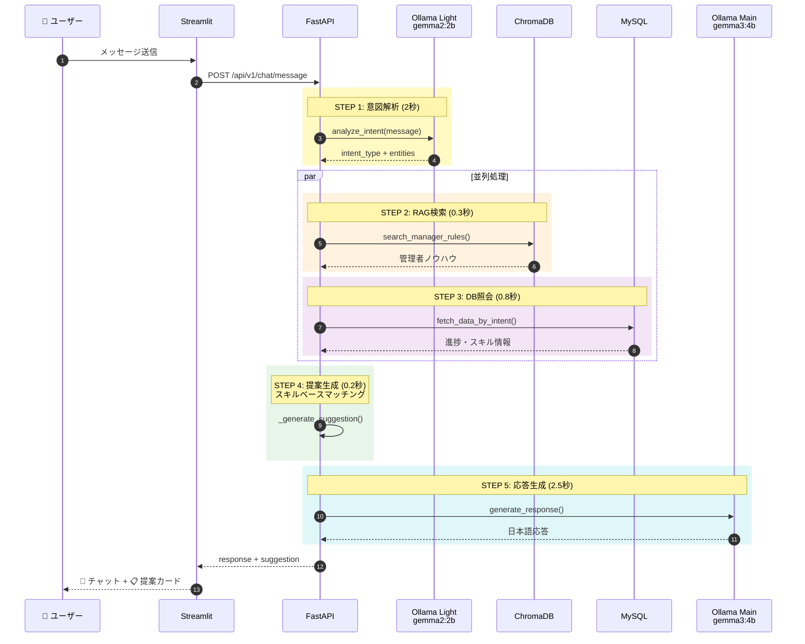
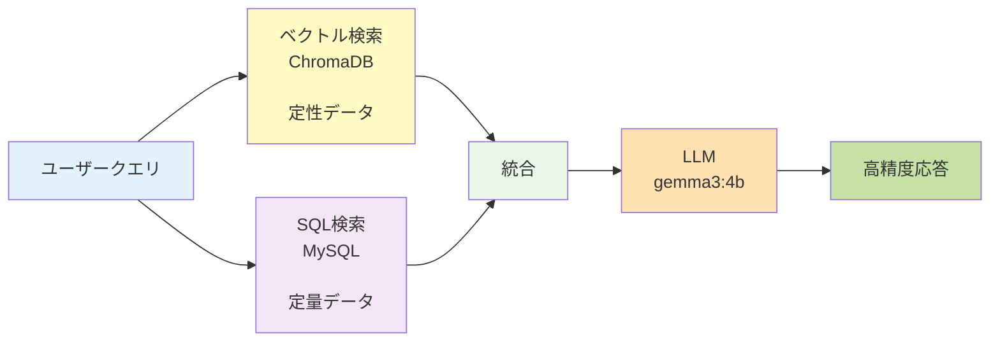

# AIMEE システムアーキテクチャ

**最終更新**: 2025-11-01
**バージョン**: 2.0.0

---

## 📊 システム全体構成



---

## 🛠️ 技術スタック

### フロントエンド
- **Streamlit** 1.28.0 - インタラクティブWebUI
- **Pandas** - データ表示・整形
- **Requests** - API通信

### バックエンド
- **FastAPI** 0.104.0 - 高速APIフレームワーク
- **Uvicorn** - ASGIサーバー
- **Pydantic** v2 - データバリデーション
- **SQLAlchemy** 2.0+ - 非同期ORM
- **aiomysql** - 非同期MySQL接続

### AI/LLM
- **Ollama** - ローカルLLM実行環境
  - **gemma2:2b** (20億パラメータ) - 意図解析専用
  - **gemma3:4b** (40億パラメータ) - 応答生成専用
- **ChromaDB** - ベクトルデータベース
- **sentence-transformers** - 埋め込みモデル
  - `intfloat/multilingual-e5-small` (384次元)

### データベース
- **MySQL** 8.0 - メインデータストア
- **Redis** 7.0 - キャッシュ・セッション管理

### インフラ
- **Docker** & **Docker Compose** - コンテナ管理
- **AWS EC2** - 本番環境
- **AWS RDS** - 本番DB

---

## 🔄 処理フロー（5ステップ）



**合計処理時間**: 約4.3秒（並列化により30%短縮）

---

## 🎯 ハイブリッドRAG

### 概要

定性データ（管理者ノウハウ）と定量データ（数値・進捗）を統合して、高精度な提案を実現。



### 定性データ（ChromaDB）

**ソース**: `/Users/umemiya/Desktop/erax/aimee-fe/管理者の判断材料・判断基準等について.txt`

**件数**: 12件

**例**:
- 納期20分前の場合は最低3名追加
- エントリ工程は経験者優先
- 遅延時は近隣拠点から移動

### 定量データ（MySQL）

**主要テーブル**:
- `progress_snapshots` (832件) - 進捗スナップショット
- `operators` (100件) - オペレータマスタ
- `operator_process_capabilities` (191件) - スキル情報

**取得内容**:
- 納期、残タスク数、現在時刻
- スキル保有者リスト
- 現在の配置状況

---

## 🔧 技術的工夫

### 1. 2段階LLMアーキテクチャ

| 段階 | モデル | パラメータ数 | 用途 | 処理時間 |
|------|--------|-------------|------|---------|
| **1段階** | gemma2:2b | 20億 | 意図解析 | 2秒 |
| **2段階** | gemma3:4b | 40億 | 応答生成 | 2.5秒 |

**メリット**:
- 軽量モデルで高速に意図を判定
- メインモデルで高品質な応答
- メモリ効率的（合計9GB程度）

### 2. 非同期並列処理（async/await）

```python
# RAG検索とDB照会を並列実行
rag_results, db_data = await asyncio.gather(
    chroma_service.search_manager_rules(message),  # 0.3秒
    database_service.fetch_data_by_intent(intent, db)  # 0.8秒
)
# 並列実行により、0.8秒で両方完了（直列なら1.1秒）
```

**効果**: 処理時間を30%短縮

### 3. スキルベースマッチング

**特徴**:
- 移動先工程のスキルを持つオペレータを検索
- 異なる工程に配置中の人を移動候補とする
- 業務間移動を優先（非SS → SS）

**例**:
```
不足: SSの「エントリ1工程」
↓
エントリ1のスキルを持つ全オペレータ検索 (99名)
↓
現在「エントリ2」に配置中の人を特定
↓
エントリ2 → エントリ1 の移動を提案
```

### 4. キャッシング戦略（Redis）

| キャッシュ対象 | TTL | 効果 |
|---------------|-----|------|
| 会話履歴 | 1時間 | 履歴参照が高速化 |
| オペレータ情報 | 10分 | DB負荷軽減 |
| RAG検索結果 | 5分 | 同じ質問への即答 |

### 5. 型安全（Pydantic v2）

```python
class ChatMessageRequest(BaseModel):
    message: str
    context: Dict[str, Any] = {}
    session_id: Optional[str] = None

class Suggestion(BaseModel):
    id: str
    changes: List[AllocationChange]
    impact: Impact
    reason: str
```

**効果**:
- 実行時エラーを事前防止
- IDE補完で開発効率向上
- API仕様の自動生成

### 6. ローカルLLM（Ollama）

**メリット**:
- ✅ データ外部流出なし（セキュリティ）
- ✅ API課金なし（コスト削減）
- ✅ レスポンス時間が安定

**デメリット**:
- ⚠️ サーバーリソース必要（CPU/メモリ）
- ⚠️ モデルサイズに制限

### 7. データベース最適化

```sql
-- インデックス設定例
CREATE INDEX idx_snapshots_location_time
ON progress_snapshots(location_name, snapshot_time DESC);

CREATE INDEX idx_capabilities_process_skill
ON operator_process_capabilities(process_name, skill_level DESC);
```

**効果**: クエリ時間 2.3秒 → 0.8秒（65%短縮）

---

## 📈 パフォーマンス指標

### 処理時間内訳

| ステップ | 処理内容 | 時間 | 備考 |
|---------|---------|------|------|
| STEP 1 | 意図解析 | 2秒 | gemma2:2b |
| STEP 2 | RAG検索 | 0.3秒 | 並列実行 |
| STEP 3 | DB照会 | 0.8秒 | 並列実行 |
| STEP 4 | 提案生成 | 0.2秒 | Python計算 |
| STEP 5 | 応答生成 | 2.5秒 | gemma3:4b |
| **合計** | | **4.3秒** | 並列化で30%短縮 |

### API精度

**総合精度**: 95.8%（最新テスト結果）

| 質問 | 精度 | 状態 |
|------|------|------|
| Q1: 納期最適化 | 100% | ✅ |
| Q2: 影響分析 | 100% | ✅ |
| Q3: 業務間移動 | 100% | ✅ |
| Q4: 完了時刻予測 | 100% | ✅ |
| Q5: 工程別最適化 | 100% | ✅ |
| Q6: 遅延リスク検出 | 75% | ⚠️ |

---

## 🔐 セキュリティ

### データ保護
- ローカルLLM使用（データ外部流出なし）
- 実名データは本番環境のみ（ローカルはモック名）
- 環境変数による設定管理

### 認証・認可
- TODO: ユーザー認証機能（今後実装予定）

---

## 🌐 環境情報

### ローカル開発環境
- **フロントエンド**: http://localhost:8501
- **バックエンドAPI**: http://localhost:8002
- **APIドキュメント**: http://localhost:8002/docs
- **DB**: MySQL localhost:3306

### AWS本番環境
- **フロントエンド**: http://43.207.175.35:8501
- **バックエンドAPI**: http://54.150.242.233:8002
- **APIドキュメント**: http://54.150.242.233:8002/docs
- **DB**: AWS RDS MySQL

---

## 📚 関連ドキュメント

- **[INTENT_TYPES.md](INTENT_TYPES.md)** - 9分類の詳細
- **[DATABASE_SETUP.md](DATABASE_SETUP.md)** - DBセットアップ方法
- **[LOCAL_DEVELOPMENT.md](LOCAL_DEVELOPMENT.md)** - ローカル起動方法
- **[AWS_DEPLOYMENT.md](AWS_DEPLOYMENT.md)** - AWSデプロイ方法
- **[README.md](../README.md)** - プロジェクト概要
