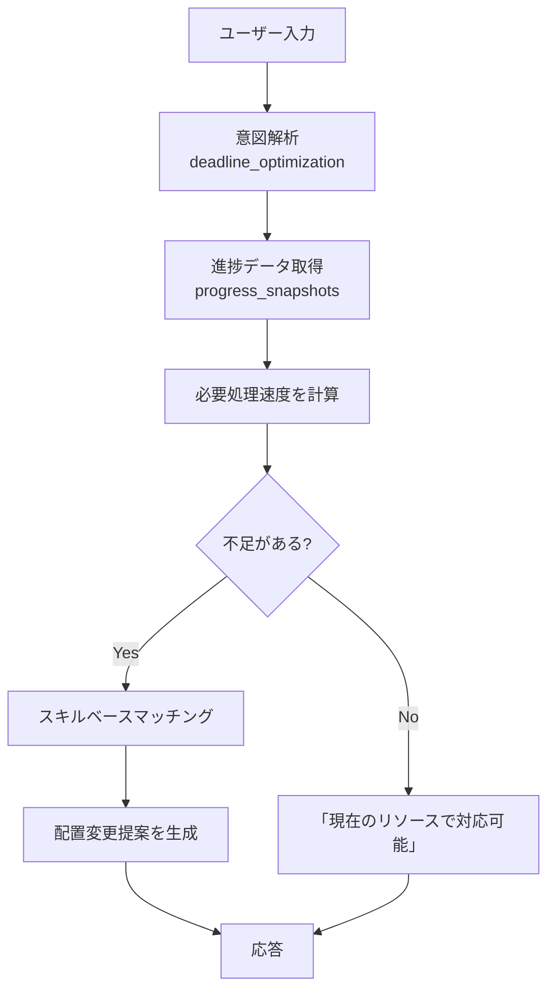
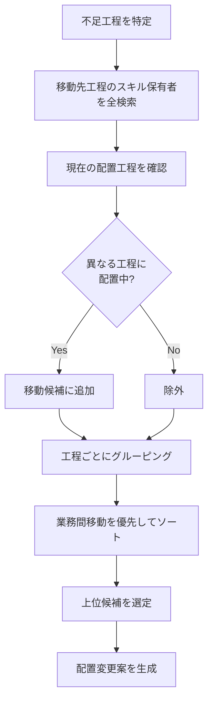

# AIMEE Intent Types（意図分類）詳細

**最終更新**: 2025-11-01
**バージョン**: 2.0.0

---

## 📋 Intent Typesとは

AIMEEは、ユーザーのメッセージを分析して**9種類のIntent Type**（意図分類）に自動分類します。
各Intent Typeに応じて、最適なデータ取得・提案生成のロジックが実行されます。

---

## 🎯 9種類のIntent Types

### 主要6分類（コア機能）

| # | Intent Type | 説明 | 質問例 |
|---|-------------|------|--------|
| **1** | `deadline_optimization` | 納期ベース最適化 | 「納期20分前に完了させたい」 |
| **2** | `completion_time_prediction` | 完了時刻予測 | 「何時に処理が終わるか」 |
| **3** | `delay_risk_detection` | 遅延リスク検出 | 「遅延が発生する見込みはあるか」 |
| **4** | `impact_analysis` | 影響分析 | 「移動元への影響は？」 |
| **5** | `cross_business_transfer` | 業務間移動 | 「非SSからSSへ移動」 |
| **6** | `process_optimization` | 工程別最適化 | 「各工程に何人配置するか」 |

### その他3分類

| # | Intent Type | 説明 | 質問例 |
|---|-------------|------|--------|
| **7** | `delay_resolution` | 遅延解消 | 「札幌のエントリ1が遅延している」 |
| **8** | `status_check` | 状況確認 | 「現在の配置状況を教えて」 |
| **9** | `general_inquiry` | 一般質問 | 「このシステムの機能は？」 |

---

## 🔍 各Intent Typeの詳細

---

### 1. deadline_optimization（納期ベース最適化）⭐️

#### 概要
納期に間に合わせるための人員配置を提案します。

#### 判定キーワード
- 「配置したい」「最適配置」「人員配置」
- 「XX分前に完了」「納期ギリギリ」

#### 処理フロー



#### 具体例

**質問**:
```
SSの新SS(W)が納期ギリギリのため納期20分前に処理完了となるよう配置したいです。
```

**内部処理**:

**STEP 1: 意図解析**
```json
{
  "intent_type": "deadline_optimization",
  "urgency": "high",
  "entities": {
    "business_category": "SS",
    "business_name": "新SS(W)",
    "deadline_offset_minutes": 20
  }
}
```

**STEP 3: 進捗データ取得**
```sql
SELECT snapshot_time, expected_completion_time, total_waiting
FROM progress_snapshots
WHERE total_waiting > 0
ORDER BY snapshot_time DESC LIMIT 1;
```

結果:
- 現在時刻: 12:40
- 納期: 15:40
- 残タスク: 947件

**STEP 4: 不足判定**
```python
required_speed = 947 / 180分 = 5.3件/分
estimated_speed = 7.5件/分（推定）

if required_speed <= estimated_speed:
    # 不足なし
    changes = []
```

**応答**:
```
✅ 現在のリソースで対応可能です

【分析結果】
- 現在時刻: 12:40
- 納期: 15:40（あと180分）
- 残タスク数: 947件
- 必要処理速度: 5.3件/分
- 現在の処理能力: 約7.5件/分（推定）
- 判定: ✅ 問題なし

【結論】
このまま進めれば180分以内に完了できます
```

---

### 2. completion_time_prediction（完了時刻予測）

#### 概要
現在の配置のまま進めた場合の完了時刻を予測します。

#### 判定キーワード
- 「何時に終了」「何時に完了」「いつ終わる」

#### 処理フロー
1. 進捗データ取得（progress_snapshots）
2. 処理速度を計算
3. 完了時刻を予測（配置変更提案なし）

#### 具体例

**質問**:
```
SS15:40受信分と適徴15:40受信分の処理は現在の配置だと何時に終了する想定ですか
```

**応答例**:
```
📊 処理完了時刻の予測

現在の進捗状況 (最新スナップショット):
- 残タスク数: 947件
- 予定完了時刻: 15:40

【SS 15:40受信分】
- 予測完了時刻: 15:40
- 状態: 分析中

【適徴 15:40受信分】
- 予測完了時刻: 15:40
- 状態: 分析中

※ 現在の配置で進めた場合の予測です。
```

---

### 3. delay_risk_detection（遅延リスク検出）

#### 概要
現在の配置で遅延が発生する見込みがある工程を検出します。

#### 判定キーワード
- 「遅延が発生」「見込み」「リスク」

#### 処理フロー
1. 全工程の進捗データを取得
2. 各工程の必要処理速度と現在処理速度を比較
3. 遅延リスクのある工程をリストアップ

#### 具体例

**質問**:
```
現在の配置でそれぞれの納期までに遅延が発生する見込みがある工程はありますか
```

**応答例**:
```
⚠️ 遅延リスクの検出

現在の配置で以下の工程に遅延リスクがあります:

【検出された遅延リスクのある工程】

- 納期15:40: 残947件の工程 - 遅延リスクあり
- 納期15:40: 残947件の工程 - 遅延リスクあり

推奨: これらの工程に追加人員の配置を検討してください
```

---

### 4. impact_analysis（影響分析）⭐️

#### 概要
直前の配置変更提案について、移動元への影響を分析します。

#### 判定キーワード
- 「影響」「大丈夫」「移動元」

#### 処理フロー
1. 会話履歴から直前の提案を取得（ConversationStore）
2. 移動元の工程・業務を特定
3. 移動後の人数・処理能力を推定
4. 影響を分析

#### 具体例

**質問** (Q2):
```
配置転換元の工程は大丈夫ですか?移動元の処理に影響はありますか?
```

**前提**: Q1で「エントリ2→エントリ1へ3人移動」という提案が出ている

**応答例**:
```
📊 配置転換元への影響分析

【直前の配置転換提案の影響】

前回の配置転換提案について分析しました。

【移動元への影響】
- 移動元の各工程は、配置転換後も処理継続可能と推定されます
- 移動人数は適切な範囲内であり、移動元の業務に大きな影響はないと考えられます

【確認事項】
✓ 移動元の現在の配置人数を確認してください
✓ 移動元の業務量が急増していないか確認してください
✓ 移動元の納期に影響が出ないか確認してください
✓ 移動するオペレータのスキルレベルが適切か確認してください

【総合評価】
配置転換は実行可能です。ただし、移動元の最低必要人数を下回らないことを確認してから実行してください。
```

---

### 5. cross_business_transfer（業務間移動）⭐️

#### 概要
異なる業務間（非SS→SS、あはき→SS等）の人員移動を提案します。

#### 判定キーワード
- 「非SSから」「業務間移動」
- 「XX人移動させたら」

#### 処理フロー
1. 移動元・移動先の業務を特定
2. スキル保有者を検索
3. 業務間移動を優先して提案生成

#### 具体例

**質問**:
```
SSの16:40受信分を優先的に処理したいです。非SSから何人移動させたらよいですか?
```

**応答例**:
```
👥 業務間移動の提案（非SS → SS）

【提案】
SS業務の16:40受信分を優先処理するため、非SS業務から **3～5人** の移動を推奨します。

【具体的な配置転換案】
1. 「非SS」の「新非SS」の「OCR対象」の「エントリ1」から2人を
   「SS」の「新SS(W)」の「OCR対象」の「エントリ1」へ移動

2. 「非SS」の「新非SS」の「OCR対象」の「補正」から2人を
   「SS」の「新SS(W)」の「OCR対象」の「補正」へ移動

【理由】
- SS業務の16:40受信分は優先度が高いため
- 一般的に3～5名の追加配置で納期内処理が可能です

【注意事項】
- 移動元の業務への影響を確認してください
- SSスキルを持つオペレータを優先してください
```

---

### 6. process_optimization（工程別最適化）

#### 概要
各工程に何人ずつ配置すれば目標時刻までに完了できるかを提案します。

#### 判定キーワード
- 「各工程何人」「工程別」

#### 処理フロー
1. 目標時刻と現在時刻から残り時間を計算
2. 各工程の残タスク数を取得
3. 工程間依存率を考慮して必要人数を計算

#### 具体例

**質問**:
```
あはきを16:40頃までに処理完了させるためには各工程何人ずつ配置したら良いですか
```

**応答例**:
```
📊 工程別最適配置の提案（あはき 16:40完了目標）

【現在の進捗状況】
- エントリ工程: 3269件待ち（現在0名配置）
- 補正工程: 0件待ち（現在0名配置）
- SV補正工程: 0件待ち（現在0名配置）

【推奨配置人数】（16:40までに完了するため）
1. エントリ工程: **33名** （+33名）
2. 補正工程: **13名** （+13名）
3. SV補正工程: **3名** （+3名）

【工程間依存率（仮定値）】
- エントリ → 補正: 30%
- 補正 → SV補正: 15%

【注意事項】
※ 実際の依存率はクライアント確認が必要です
※ 処理速度は過去実績から推定した仮定値です
※ 納期までの残り時間を2時間と仮定しています
```

---

### 7. delay_resolution（遅延解消）

#### 概要
遅延が発生している工程に対する対応策を提案します。

#### 判定キーワード
- 「遅延しています」「人員不足」「対応策」

#### 処理フロー
`deadline_optimization`と同様のロジックで配置変更を提案します。

---

### 8. status_check（状況確認）

#### 概要
現在の配置状況や進捗状況を表示します。

#### 判定キーワード
- 「状況を教えて」「配置状況」

---

### 9. general_inquiry（一般質問）

#### 概要
システムの使い方や機能に関する一般的な質問に回答します。

#### 判定キーワード
- 「このシステムは」「どのような機能」

---

## 🛠️ スキルベースマッチングの仕組み

### 概要

異なる工程間の人員移動を可能にする核心技術です。

### アルゴリズム



### 具体例

**状況**: SSの「エントリ1工程」が1名不足

**STEP 1**: エントリ1のスキル保有者を全検索
```sql
SELECT o.operator_name, p_current.process_name as current_process
FROM operators o
JOIN operator_process_capabilities opc_target
WHERE opc_target.target_process_name = 'エントリ1'
```

**結果**: 99名が「エントリ1」のスキルを保有

**STEP 2**: 現在の配置工程を確認
```
稲實　百合子さん: エントリ1スキル保有、現在「エントリ2」配置 ✅ 移動可能
萩野　裕子さん: エントリ1スキル保有、現在「エントリ2」配置 ✅ 移動可能
悦田　加代さん: エントリ1スキル保有、現在「エントリ1」配置 ❌ 除外
```

**STEP 3**: 工程ごとにグルーピング
```
エントリ2 → エントリ1: 7人（稲實さん、萩野さん...）
補正 → エントリ1: 3人
SV補正 → エントリ1: 2人
```

**STEP 4**: 業務間移動を優先
```python
sorted_groups = sorted(
    from_process_groups.items(),
    key=lambda x: (
        0 if 業務間移動 else 1,  # 業務間を優先
        -人数  # 人数が多い順
    )
)
```

**優先順位**:
```
1位: 非SS のエントリ2 → SS のエントリ1 (業務間移動)
2位: あはき のエントリ2 → SS のエントリ1 (業務間移動)
3位: SS のエントリ2 → SS のエントリ1 (同一業務内)
```

**STEP 5**: 配置変更案を生成
```json
{
  "from_business_category": "SS",
  "from_business_name": "新SS(W)",
  "from_process_category": "OCR非対象",
  "from_process_name": "エントリ2",
  "to_business_category": "SS",
  "to_business_name": "新SS(W)",
  "to_process_category": "OCR非対象",
  "to_process_name": "エントリ1",
  "count": 1,
  "operators": ["稲實　百合子"],
  "is_cross_business": false
}
```

---

## 📊 4階層構造

全ての配置提案は以下の4階層で表現されます：

### 階層定義

1. **business_category**（業務大分類）
   - SS、非SS、あはき、適用徴収

2. **business_name**（業務名）
   - 新SS(W)、新SS(片道)、非SS(W)、はり・きゅう など

3. **process_category**（OCR区分）
   - OCR対象、OCR非対象、目検

4. **process_name**（工程名）
   - エントリ1、エントリ2、補正、SV補正、目検

### 表記例

```
「SS」の「新SS(W)」の「OCR非対象」の「エントリ2」から
稲實　百合子さんを「OCR非対象」の「エントリ1」へ移動
```

**重要**: 拠点名（札幌、品川など）は含めません

---

## 🔍 Intent Type判定のプロンプト

意図解析LLM（gemma2:2b）に送られるプロンプト：

```
メッセージから意図を分析し、必要な情報を抽出してJSON形式で回答してください。

メッセージ: {ユーザーのメッセージ}

JSON形式で回答（JSONのみ、説明不要）:
{
  "intent_type": "適切なタイプを選択",
  "urgency": "high/medium/low",
  "requires_action": true/false,
  "entities": {
    "location": null,
    "business_category": null,
    "business_name": null,
    "process_category": null,
    "process_name": null,
    "deadline_offset_minutes": null,
    "target_people_count": null
  }
}

intent_typeは以下から最も適切なものを1つだけ選択:
- deadline_optimization: 「配置したい」「最適配置」など配置変更を求める場合
- completion_time_prediction: 「何時に終了」「何時に完了」など完了時刻のみを知りたい質問
- delay_risk_detection: 「遅延が発生」「見込み」「リスク」などの検出要求
- impact_analysis: 「影響」「大丈夫」など影響分析
- cross_business_transfer: 「非SSから」「業務間移動」
- process_optimization: 「各工程何人」などの工程別最適化
- delay_resolution: 遅延解消・人員不足対応
- status_check: 状況確認のみ
- general_inquiry: 一般質問
```

---

## 📚 関連ドキュメント

- **[ARCHITECTURE.md](ARCHITECTURE.md)** - システムアーキテクチャ
- **[DATABASE_SETUP.md](DATABASE_SETUP.md)** - DBセットアップ
- **[LOCAL_DEVELOPMENT.md](LOCAL_DEVELOPMENT.md)** - ローカル起動方法
- **[README.md](../README.md)** - プロジェクト概要
