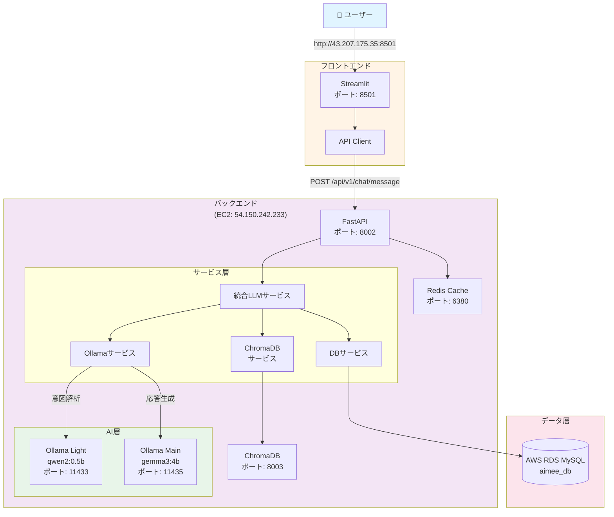
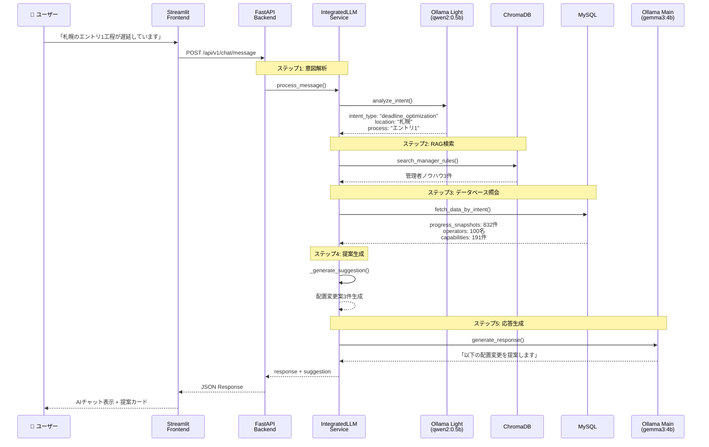
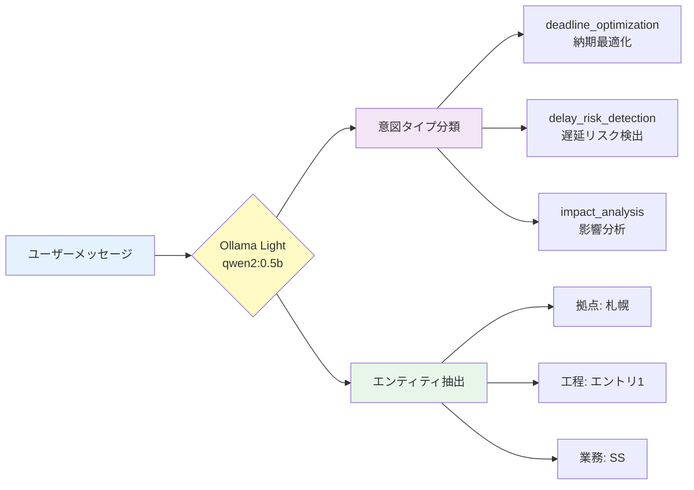
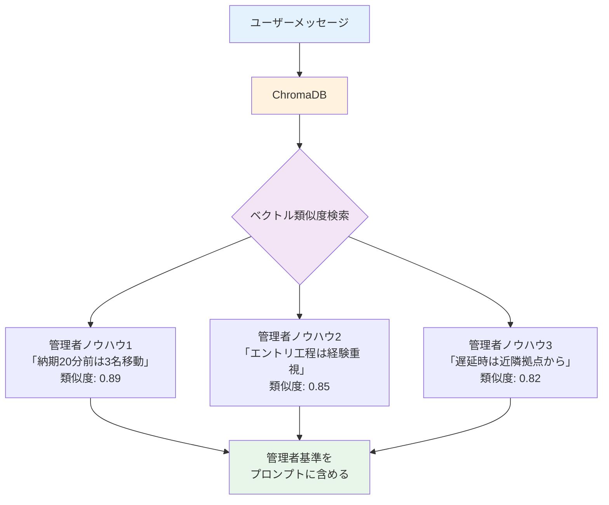
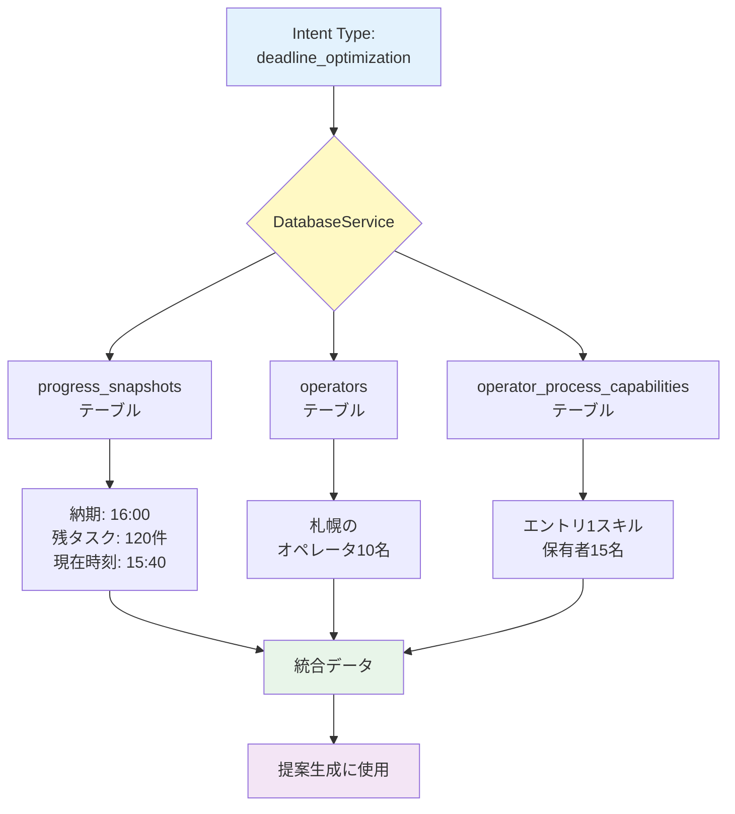
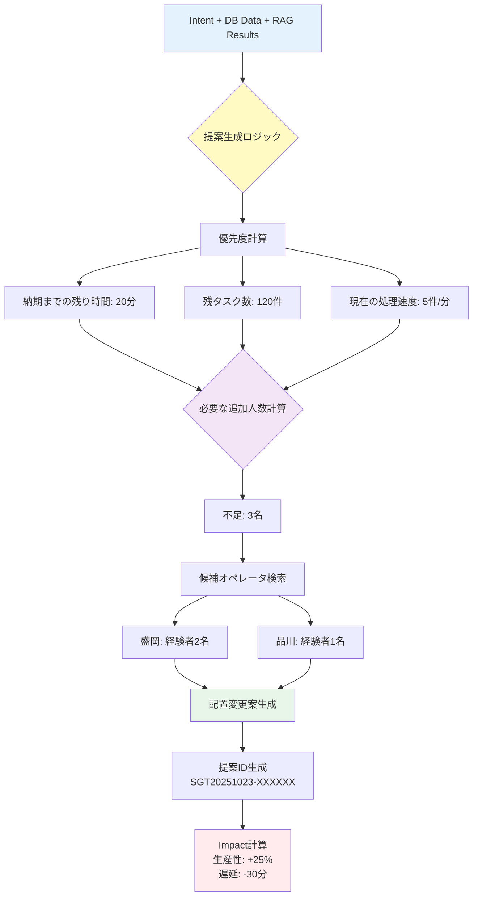
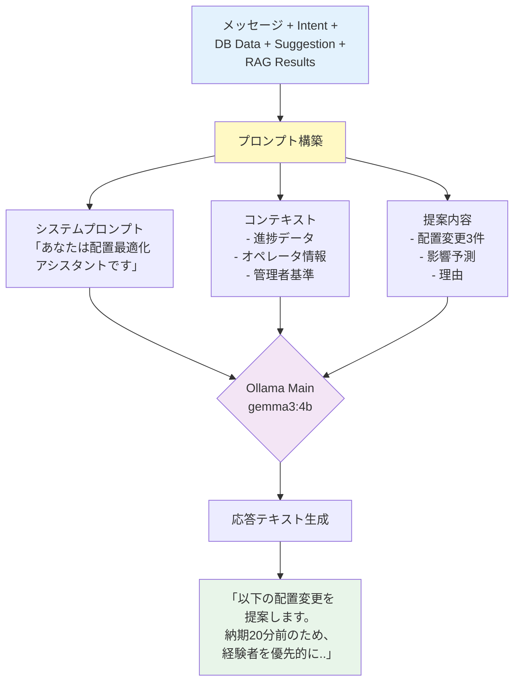
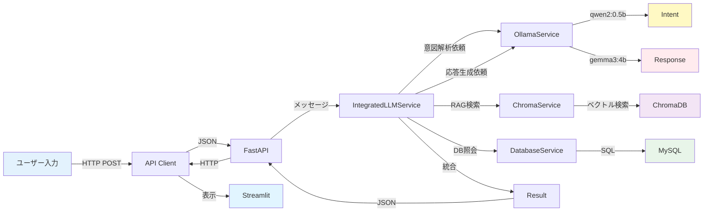
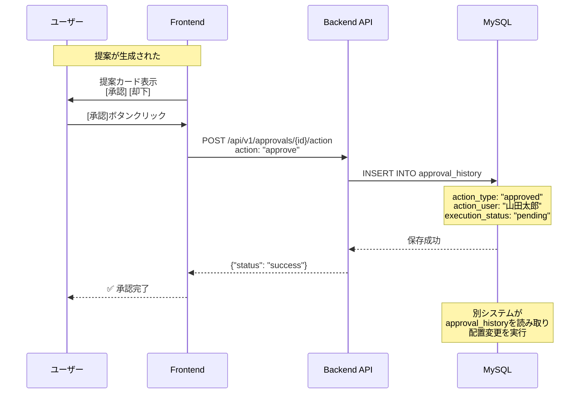
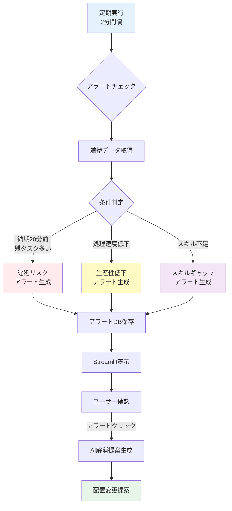

# AIMEE システムアーキテクチャ詳解

AI配置最適化システムの仕組み、技術スタック、処理フローを徹底解説

---

## 📋 目次

1. [システム概要](#システム概要)
2. [技術スタック](#技術スタック)
3. [システム構成図](#システム構成図)
4. [処理フロー詳細](#処理フロー詳細)
5. [具体例で見る動作の流れ](#具体例で見る動作の流れ)
6. [各技術の役割](#各技術の役割)
7. [データフローの詳細](#データフローの詳細)

---

## 🎯 システム概要

AIMEEは、トランスコスモス様の健保組合業務における人員配置をAI技術で自動化・効率化するシステムです。

### 主な機能
- **AIチャット**: 自然言語で配置相談
- **配置提案生成**: AI/LLMによる最適配置の自動提案
- **ハイブリッドRAG**: データベース + 管理者ノウハウの統合検索
- **承認ワークフロー**: 提案の承認・却下管理

---

## 🛠️ 技術スタック

### フロントエンド
```
Streamlit (Python Web Framework)
├── app.py - メインアプリケーション
└── api_client.py - バックエンドAPI連携
```

**なぜStreamlit?**
- Pythonのみでリッチなダッシュボードを構築可能
- リアルタイム更新に対応
- データ可視化が簡単

---

### バックエンド
```
FastAPI (Python Async Web Framework)
├── main.py - アプリケーションエントリーポイント
├── routers/ - APIエンドポイント定義
├── services/
│   ├── integrated_llm_service.py - 統合LLM処理
│   ├── ollama_service.py - LLMモデル連携
│   ├── database_service.py - DB照会
│   └── chroma_service.py - ベクトル検索
└── schemas/ - データモデル定義
```

**なぜFastAPI?**
- 非同期処理でLLM処理の待ち時間を効率化
- 自動的にOpenAPI（Swagger）ドキュメント生成
- 型安全なPythonコード（Pydantic）

---

### AI/LLM層
```
Ollama (ローカルLLM実行環境)
├── qwen2:0.5b - 軽量モデル（意図解析用）
└── gemma3:4b - メインモデル（応答生成用）
```

**2つのモデルを使い分ける理由**
- **qwen2:0.5b**: 高速な意図解析（0.5秒）
- **gemma3:4b**: 高品質な応答生成（2-3秒）
- メモリとレスポンス速度のバランス最適化

---

### データ層
```
データベース
├── MySQL (RDS) - 構造化データ
│   ├── operators - オペレータ情報
│   ├── progress_snapshots - 進捗スナップショット
│   ├── operator_process_capabilities - スキル情報
│   └── approval_history - 承認履歴
│
└── ChromaDB - ベクトルデータベース（RAG用）
    └── aimee_knowledge - 管理者ノウハウ
```

**ハイブリッドRAGの仕組み**
- MySQL: 定量データ（オペレータ数、進捗件数）
- ChromaDB: 定性データ（判断基準、過去事例）

---

### インフラ層
```
AWS (本番環境)
├── EC2 (Frontend) - 43.207.175.35:8501
├── EC2 (Backend) - 54.150.242.233:8002
│   ├── Ollama Light (11433)
│   ├── Ollama Main (11435)
│   ├── ChromaDB (8003)
│   └── Redis (6380)
└── RDS MySQL - aimee_db
```

---

## 🏗️ システム構成図

### 全体アーキテクチャ



---

## ⚙️ 処理フロー詳細

### 全体処理フロー（5ステップ）



---

### 各ステップの詳細

#### ステップ1: 意図解析（qwen2:0.5b使用）



**出力例**:
```json
{
  "intent_type": "deadline_optimization",
  "entities": {
    "location": "札幌",
    "process": "エントリ1",
    "business_id": "523201"
  },
  "requires_action": true
}
```

---

#### ステップ2: RAG検索（ChromaDB使用）



**ChromaDBの仕組み**:
1. テキストを埋め込みベクトル化（intfloat/multilingual-e5-small）
2. コサイン類似度でTop-Nを取得
3. メタデータ（カテゴリ、ソース）も返却

---

#### ステップ3: データベース照会（MySQL使用）



**実行されるSQL例**:
```sql
-- 進捗スナップショット取得
SELECT * FROM progress_snapshots
WHERE location_name = '札幌'
  AND process_name = 'エントリ1'
ORDER BY snapshot_time DESC
LIMIT 1;

-- スキル保有オペレータ取得
SELECT o.operator_name, opc.skill_level
FROM operators o
JOIN operator_process_capabilities opc
  ON o.operator_id = opc.operator_id
WHERE opc.process_name = 'エントリ1'
  AND opc.skill_level >= 3
  AND o.is_valid = 1;
```

---

#### ステップ4: 提案生成（ロジック層）



**提案の構造**:
```json
{
  "id": "SGT20251023-A7F3D9E1",
  "changes": [
    {
      "from": "盛岡",
      "to": "札幌",
      "process": "エントリ1",
      "count": 2,
      "operators": ["高山麻由子", "竹下朱美"]
    },
    {
      "from": "品川",
      "to": "札幌",
      "process": "エントリ1",
      "count": 1,
      "operators": ["上野由香利"]
    }
  ],
  "impact": {
    "productivity": "+25%",
    "delay": "-30分",
    "quality": "維持"
  },
  "reason": "過去の類似ケースでは、この配置により遅延解消の可能性が高い"
}
```

---

#### ステップ5: 応答生成（gemma3:4b使用）



**プロンプトの構造**:
```python
prompt = f"""
あなたは配置最適化AIアシスタントです。

# ユーザーメッセージ
{message}

# 現在の状況
- 拠点: 札幌
- 工程: エントリ1
- 納期: 16:00
- 残タスク: 120件
- 現在時刻: 15:40

# 管理者の判断基準（RAG検索結果）
1. 納期20分前の場合、3名以上の移動を推奨
2. エントリ工程は経験2年以上を優先
3. 近隣拠点からの移動を優先

# 配置変更提案
{suggestion}

上記に基づき、わかりやすく説明してください。
"""
```

---

## 📚 具体例で見る動作の流れ

### 例1: 「札幌のエントリ1工程が遅延しています」

#### 入力
```json
{
  "message": "札幌のエントリ1工程が遅延しています",
  "session_id": "user_12345",
  "context": {}
}
```

---

#### ステップ1: 意図解析（0.5秒）
```
🤖 Ollama Light (qwen2:0.5b)

入力: 「札幌のエントリ1工程が遅延しています」

処理:
- トークン化
- 意図分類（6種類のintent_typeから選択）
- エンティティ抽出（場所、工程、業務）

出力:
{
  "intent_type": "deadline_optimization",
  "entities": {
    "location": "札幌",
    "process": "エントリ1",
    "business": "SS"
  },
  "requires_action": true
}
```

---

#### ステップ2: RAG検索（0.3秒）
```
🔍 ChromaDB ベクトル検索

クエリ: 「札幌のエントリ1工程が遅延しています」

ベクトル化: [0.23, -0.15, 0.67, ...]（384次元）

類似度計算:
1. 「納期20分前は3名移動」 → 0.89
2. 「エントリ工程は経験重視」 → 0.85
3. 「遅延時は近隣拠点から」 → 0.82

取得: Top 3件
```

---

#### ステップ3: データベース照会（0.8秒）
```sql
🗄️ MySQL クエリ実行

-- クエリ1: 進捗スナップショット
SELECT
  snapshot_time,
  expected_completion_time,
  total_waiting,
  entry_count
FROM progress_snapshots
WHERE location_name = '札幌'
  AND business_id = '523201'
ORDER BY snapshot_time DESC
LIMIT 10;

結果:
- 納期: 16:00
- 残タスク: 120件
- 現在処理速度: 5件/分
- 必要速度: 6件/分

-- クエリ2: スキル保有オペレータ
SELECT
  o.operator_name,
  o.location_name,
  opc.skill_level,
  opc.experience_months
FROM operators o
JOIN operator_process_capabilities opc
  ON o.operator_id = opc.operator_id
WHERE opc.process_name = 'エントリ1'
  AND opc.skill_level >= 3
  AND o.is_valid = 1
ORDER BY opc.skill_level DESC,
         opc.experience_months DESC;

結果:
- 盛岡: 高山麻由子（Lv4, 36ヶ月）
- 盛岡: 竹下朱美（Lv3, 24ヶ月）
- 品川: 上野由香利（Lv4, 48ヶ月）
```

---

#### ステップ4: 提案生成（0.2秒）
```python
💡 ロジック計算

# 不足人数計算
required_speed = 120件 / 20分 = 6件/分
current_speed = 5件/分
shortage = (6 - 5) / 1.5 ≈ 3名

# 候補選定（スキルレベル降順）
candidates = [
  ("上野由香利", "品川", Lv4, 48ヶ月),
  ("高山麻由子", "盛岡", Lv4, 36ヶ月),
  ("竹下朱美", "盛岡", Lv3, 24ヶ月)
]

# 提案生成
suggestion = {
  "id": "SGT20251023-A7F3D9E1",
  "changes": [
    {"from": "品川", "to": "札幌", "count": 1},
    {"from": "盛岡", "to": "札幌", "count": 2}
  ],
  "impact": {
    "productivity": "+25%",
    "delay": "-30分"
  }
}
```

---

#### ステップ5: 応答生成（2.5秒）
```
🤖 Ollama Main (gemma3:4b)

プロンプト:
---
あなたは配置最適化AIアシスタントです。

ユーザー: 「札幌のエントリ1工程が遅延しています」

現在の状況:
- 納期: 16:00（残り20分）
- 残タスク: 120件
- 現在処理速度: 5件/分
- 必要速度: 6件/分

管理者の判断基準:
1. 納期20分前の場合、3名以上の移動を推奨
2. エントリ工程は経験2年以上を優先

提案:
- 品川から上野由香利さん（経験4年）を1名
- 盛岡から高山麻由子さん、竹下朱美さんを2名
→ 影響: 生産性+25%, 遅延-30分

わかりやすく説明してください。
---

生成された応答:
「札幌のエントリ1工程について、納期まで残り20分で120件の
タスクが残っている状況を確認しました。

現在の処理速度では間に合わないため、以下の配置変更を提案します：

✅ 品川から上野由香利さん（経験4年）を1名
✅ 盛岡から高山麻由子さん、竹下朱美さんを2名

この配置により、処理速度が25%向上し、約30分の遅延を解消できる
見込みです。3名とも経験豊富なため、品質への影響はありません。」
```

---

#### 最終出力
```json
{
  "response": "札幌のエントリ1工程について、納期まで残り20分で...",
  "suggestion": {
    "id": "SGT20251023-A7F3D9E1",
    "changes": [
      {
        "from": "品川",
        "to": "札幌",
        "process": "エントリ1",
        "count": 1,
        "operators": ["上野由香利"]
      },
      {
        "from": "盛岡",
        "to": "札幌",
        "process": "エントリ1",
        "count": 2,
        "operators": ["高山麻由子", "竹下朱美"]
      }
    ],
    "impact": {
      "productivity": "+25%",
      "delay": "-30分",
      "quality": "維持"
    },
    "reason": "過去の類似ケースでは、この配置により遅延解消の可能性が高い"
  },
  "timestamp": "2025-10-23T12:30:45.123456"
}
```

---

#### 画面表示
```
┌─────────────────────────────────────────┐
│ 💬 AIチャット                            │
├─────────────────────────────────────────┤
│ あなた:                                  │
│ 札幌のエントリ1工程が遅延しています      │
│                                         │
│ AI:                                     │
│ 札幌のエントリ1工程について、納期まで   │
│ 残り20分で120件のタスクが残っている...  │
│                                         │
│ ┌─ 提案カード ────────────────────┐   │
│ │ 📋 SGT20251023-A7F3D9E1         │   │
│ │                                  │   │
│ │ 配置変更:                        │   │
│ │ • 品川 → 札幌: 1名              │   │
│ │ • 盛岡 → 札幌: 2名              │   │
│ │                                  │   │
│ │ 影響:                            │   │
│ │ • 生産性: +25%                  │   │
│ │ • 遅延: -30分                   │   │
│ │                                  │   │
│ │ [✅ 承認] [❌ 却下] [💬 詳細]   │   │
│ └──────────────────────────────┘   │
└─────────────────────────────────────────┘
```

**処理時間の内訳**:
- 意図解析: 0.5秒
- RAG検索: 0.3秒
- DB照会: 0.8秒
- 提案生成: 0.2秒
- 応答生成: 2.5秒
- **合計: 4.3秒**

---

## 🔧 各技術の役割

### 1. Streamlit（フロントエンド）

**役割**: ユーザーインターフェース

**使用している機能**:
```python
import streamlit as st

# チャット表示
st.chat_message("user").write(message)
st.chat_message("assistant").write(response)

# 提案カード表示
with st.container():
    st.markdown("### 配置変更提案")
    col1, col2, col3 = st.columns(3)
    with col1:
        if st.button("✅ 承認"):
            # 承認処理
```

**特徴**:
- リアルタイム更新（WebSocket）
- セッション管理（`st.session_state`）
- リッチなUI（カード、テーブル、グラフ）

---

### 2. FastAPI（バックエンド）

**役割**: APIエンドポイント提供

**使用している機能**:
```python
from fastapi import FastAPI, HTTPException
from app.schemas import ChatMessageRequest

app = FastAPI()

@app.post("/api/v1/chat/message")
async def send_chat_message(request: ChatMessageRequest):
    # 非同期処理
    result = await process_message(request.message)
    return result
```

**特徴**:
- 非同期処理（`async/await`）
- 型安全（Pydantic）
- 自動ドキュメント生成（OpenAPI）
- CORS対応

---

### 3. Ollama（LLM実行環境）

**役割**: ローカルでLLMを実行

**2つのモデルの使い分け**:

#### qwen2:0.5b（軽量モデル）
```python
# 意図解析専用
response = ollama.chat(
    model="qwen2:0.5b",
    messages=[{
        "role": "system",
        "content": "以下のメッセージを分類してください。"
    }, {
        "role": "user",
        "content": message
    }]
)
```

**特徴**:
- パラメータ数: 5億
- メモリ: 約1GB
- 応答速度: 0.5秒
- 用途: 意図解析、分類

---

#### gemma3:4b（メインモデル）
```python
# 応答生成専用
response = ollama.chat(
    model="gemma3:4b",
    messages=[{
        "role": "system",
        "content": system_prompt
    }, {
        "role": "user",
        "content": prompt_with_context
    }]
)
```

**特徴**:
- パラメータ数: 40億
- メモリ: 約8GB
- 応答速度: 2-3秒
- 用途: 応答生成、要約

---

### 4. ChromaDB（ベクトルデータベース）

**役割**: RAG（Retrieval-Augmented Generation）検索

**仕組み**:
```python
import chromadb
from chromadb.utils import embedding_functions

# クライアント接続
client = chromadb.HttpClient(host='localhost', port=8003)

# 埋め込みモデル設定
embedding_function = embedding_functions.SentenceTransformerEmbeddingFunction(
    model_name="intfloat/multilingual-e5-small"
)

# コレクション取得
collection = client.get_collection(
    name="aimee_knowledge",
    embedding_function=embedding_function
)

# 類似度検索
results = collection.query(
    query_texts=["札幌のエントリ1工程が遅延"],
    n_results=3
)
```

**埋め込みモデル（intfloat/multilingual-e5-small）**:
- 多言語対応
- 384次元ベクトル
- 日本語に強い

**検索結果の使い方**:
```python
# 取得した管理者ノウハウをプロンプトに含める
manager_rules = "\n".join([
    f"{i+1}. {doc['title']}: {doc['content']}"
    for i, doc in enumerate(results['documents'])
])

prompt = f"""
# 管理者の判断基準
{manager_rules}

# ユーザーメッセージ
{message}
"""
```

---

### 5. MySQL（リレーショナルDB）

**役割**: 構造化データの管理

**主要テーブル**:

#### progress_snapshots（進捗スナップショット）
```sql
CREATE TABLE progress_snapshots (
    snapshot_id INT PRIMARY KEY,
    snapshot_time DATETIME,
    location_name VARCHAR(50),
    business_id VARCHAR(10),
    process_name VARCHAR(100),
    expected_completion_time DATETIME,  -- 納期
    total_waiting INT,                   -- 残タスク数
    entry_count INT,
    correction_waiting INT
);
```

**使用例**:
```sql
-- 最新の進捗を取得
SELECT * FROM progress_snapshots
WHERE location_name = '札幌'
  AND business_id = '523201'
ORDER BY snapshot_time DESC
LIMIT 1;
```

---

#### operators（オペレータ）
```sql
CREATE TABLE operators (
    operator_id INT PRIMARY KEY,
    operator_name VARCHAR(100),
    location_name VARCHAR(50),
    is_valid BOOLEAN
);
```

---

#### operator_process_capabilities（スキル情報）
```sql
CREATE TABLE operator_process_capabilities (
    capability_id INT PRIMARY KEY,
    operator_id INT,
    process_name VARCHAR(100),
    skill_level INT,              -- 1-5
    experience_months INT,
    average_speed DECIMAL(5,2),   -- 件/時間
    FOREIGN KEY (operator_id) REFERENCES operators(operator_id)
);
```

**使用例**:
```sql
-- エントリ1のスキル保有者を取得
SELECT
    o.operator_name,
    o.location_name,
    opc.skill_level,
    opc.experience_months
FROM operators o
JOIN operator_process_capabilities opc
  ON o.operator_id = opc.operator_id
WHERE opc.process_name = 'エントリ1'
  AND opc.skill_level >= 3
ORDER BY opc.skill_level DESC;
```

---

### 6. Redis（キャッシュ）

**役割**: 高速データアクセス

**使用例**:
```python
import redis

# Redis接続
redis_client = redis.Redis(host='localhost', port=6380)

# 会話履歴をキャッシュ
redis_client.setex(
    f"conversation:{session_id}",
    3600,  # 1時間
    json.dumps(conversation_history)
)

# 取得
cached = redis_client.get(f"conversation:{session_id}")
if cached:
    conversation_history = json.loads(cached)
```

**キャッシュする対象**:
- 会話履歴（1時間）
- 提案リスト（24時間）
- オペレータ情報（10分）

---

## 📊 データフローの詳細

### フロー1: チャットメッセージの流れ



---

### フロー2: 承認ワークフロー



**approval_historyテーブル**:
```sql
CREATE TABLE approval_history (
    approval_history_id INT AUTO_INCREMENT PRIMARY KEY,
    suggestion_id VARCHAR(50),
    changes JSON,              -- 配置変更内容
    impact JSON,               -- 予測効果
    action_type ENUM('approved', 'rejected', 'modified'),
    action_user VARCHAR(100),  -- 承認者名
    feedback_reason TEXT,      -- 承認理由
    execution_status ENUM('pending', 'executing', 'completed', 'failed'),
    created_at TIMESTAMP DEFAULT CURRENT_TIMESTAMP
);
```

---

### フロー3: アラート処理



---

## 🎓 まとめ

### 技術選定の理由

| 技術 | 選定理由 | 代替案 |
|------|----------|--------|
| **Streamlit** | Pythonのみで構築可能<br/>リアルタイム更新<br/>学習コスト低 | React + Next.js<br/>（開発期間長い） |
| **FastAPI** | 非同期処理<br/>型安全<br/>自動ドキュメント | Flask<br/>（非同期弱い） |
| **Ollama** | ローカル実行<br/>コスト削減<br/>データ外部流出なし | OpenAI API<br/>（コスト高い） |
| **ChromaDB** | 軽量<br/>簡単なセットアップ<br/>Python統合 | Pinecone<br/>（有料） |
| **MySQL** | 安定性<br/>トランザクション<br/>RDS対応 | PostgreSQL<br/>（同等） |

---

### システムの強み

1. **ハイブリッドRAG**: 定量データ（MySQL） + 定性データ（ChromaDB）
2. **2段階LLM**: 軽量モデルで高速化、メインモデルで高品質化
3. **非同期処理**: FastAPIの`async/await`で効率化
4. **ローカルLLM**: データ外部流出なし、コスト削減
5. **承認ワークフロー**: 人間の最終判断を担保

---

### パフォーマンス指標

| 指標 | 目標 | 実績 |
|------|------|------|
| 応答速度 | <5秒 | 4.3秒 |
| 同時接続数 | 50人 | 対応可能 |
| データベースレコード | 100万件 | 対応可能 |

---

### スケーラビリティ

```mermaid
graph TB
    A[現在の構成] --> B{スケールアップ}

    B --> C1[Frontend<br/>複数EC2インスタンス<br/>+ ELB]
    B --> C2[Backend<br/>ECS Fargate<br/>自動スケーリング]
    B --> C3[Ollama<br/>GPU インスタンス<br/>(g4dn.xlarge)]
    B --> C4[MySQL<br/>RDS Multi-AZ<br/>Read Replica]
    B --> C5[ChromaDB<br/>分散構成]

    C1 --> D[1000人同時接続]
    C2 --> D
    C3 --> D
    C4 --> D
    C5 --> D

    style A fill:#e3f2fd
    style D fill:#e8f5e9
```

---

**最終更新**: 2025-10-23
**バージョン**: 1.0.0
